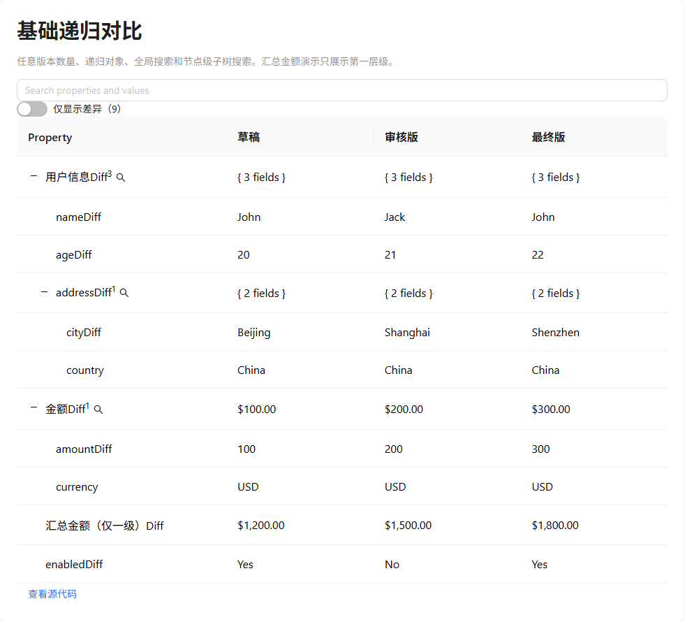
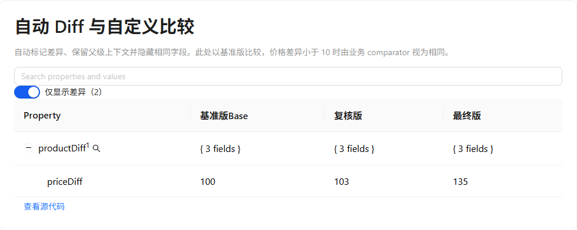
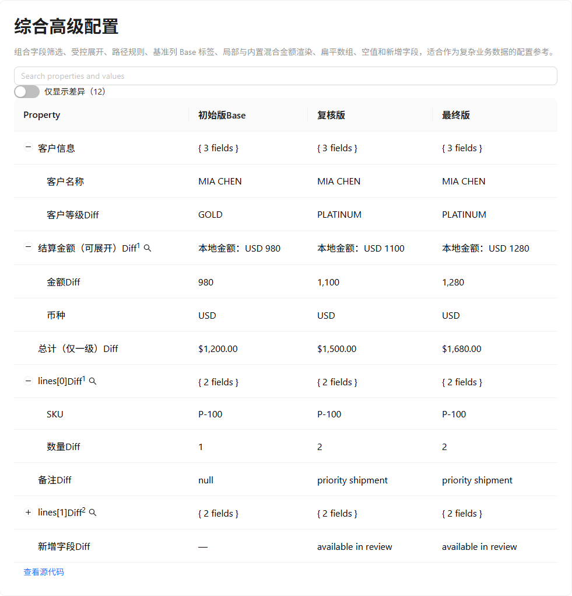
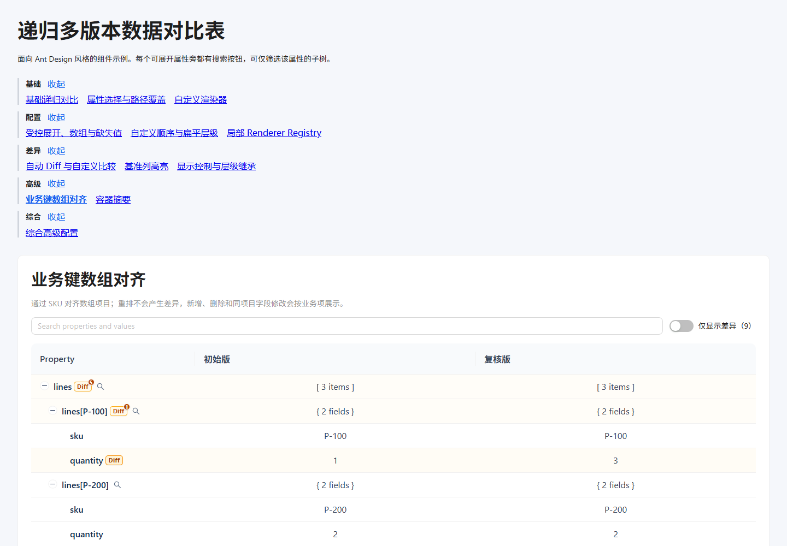

# Comparison Table

`@jxi/comparison-table` is a React and Ant Design 5 component for recursively comparing multiple versions of structured data. The repository is a pnpm workspace containing the published library and a separate demo application.

## Packages

- [`packages/comparison-table`](./packages/comparison-table): published library, named `@jxi/comparison-table`.
- [`apps/demo`](./apps/demo): Vite playground and component examples. It is not included in the npm package.

## Install and use

```bash
pnpm add @jxi/comparison-table antd @ant-design/icons react react-dom
```

Import the component and its stylesheet from public package paths:

```tsx
import { RecursiveComparisonTable } from '@jxi/comparison-table';
import '@jxi/comparison-table/styles.css';

const versions = [
  { id: 'draft', label: 'Draft', data: { title: 'Starter' } },
  { id: 'final', label: 'Final', data: { title: 'Starter Plus' } },
];

export function App() {
  return <RecursiveComparisonTable versions={versions} />;
}
```

For business-keyed arrays, map the array path to its identity field. Items are then aligned by
identity instead of array position:

```tsx
<RecursiveComparisonTable versions={versions} arrayItemKeyFields={{ lines: 'sku' }} />
```

Each configured item must have a unique, non-blank string identity within every version; duplicate,
missing, or blank identities fail during row construction with the array path, version, and field.
`Added` and `Removed` are relative to `comparison.baseVersionId` (or the first version when it is
omitted), while keyed rows retain presence for every version. See the [package README](./packages/comparison-table/README.md#business-keyed-arrays)
for the full keyed-array contract.

The library declares React, React DOM, Ant Design, and Ant Design Icons as peer dependencies. The consuming application must provide compatible versions.

## Final merge resolution

Merge resolution is off by default. Opt in with `merge={{ enabled: true }}` to add a final `Final`
column. For controlled usage pass a `value` record and write each `onChange` proposal back; for
uncontrolled usage seed the record with `defaultValue`.

```tsx
const [resolutions, setResolutions] = useState<MergeResolutions>({});

<RecursiveComparisonTable
  versions={versions}
  arrayItemKeyFields={{ lines: 'sku' }}
  merge={{
    enabled: true,
    value: resolutions,
    onChange: setResolutions,
    onComplete: (result) => save(result.mergedData),
  }}
/>;
```

Keyed item presence is resolved first with `Include from <version>` or `Exclude`; identity fields
are automatic. A non-keyed array is selected as one atomic whole array. Composite keys are not
native: materialize each composite key into one canonical string identity field before configuring
`arrayItemKeyFields`.

`mergedData` is a deeply independent structured-clone snapshot for supported JSON-like values and
`Date` objects. Values that cannot be cloned, such as functions and symbols, fail explicitly with
their logical path and type (the U1 clone boundary). `onComplete` is limited to a user-submitted
incomplete-to-complete transition; mount, initial `defaultValue`, duplicate rerenders, and external
controlled replacements do not trigger it (the U2 submission boundary).

Source choices (`MergeResolutions`) and committed raw edits (`MergeEdits`) are independent state.
Use `edits`, `defaultEdits`, and `onEditsChange` beside `value`, `defaultValue`, and `onChange`.
In controlled mode, `onComplete` waits until the parent echoes both the value/source and edits pair.
Selecting a container source makes visible children inherit it; a child can override that source and
Clear returns the child to its nearest active ancestor. This applies to object containers, keyed array
containers and items, while keyed item presence still resolves with Include or Exclude first.
`scope` and `sourceDecisions` jointly provide the audit trail: scope records active parent/container
source inheritance, while source decisions record each child override or inherited outcome.

Raw renderer isolation means `mergeEditor` commits raw values and never reads `renderer` or
`renderValue` output. The built-in text,
number, and boolean editors cover primitive edits; a custom `mergeEditor` supports domain validation
and raw values such as Date, decimal, enum, or other custom primitives. Object and array edit values
are rejected even when a custom editor is configured. `resolvedPatch` is the baseline-relative,
canonical, stable, non-overlap migration surface containing final leaf and presence operations.
Replay is independent of user click order, and replay is independent of parent/child patch execution order;
consumers need not reconstruct changes from displayed cells.

## What it supports

- Any number of version columns, with recursive objects, arrays, nulls, and newly introduced fields.
- Global search plus per-container subtree search.
- Field selection, path rules, explicit definitions, custom ordering, and flattened levels.
- Built-in and table-local renderer registries, including selective built-in overrides.
- Automatic Diff detection, custom business comparators, inherited Diff/search controls, and a baseline `Base` column marker.
- Business-keyed array alignment with stable keyed paths, reorder-insensitive comparison, and per-version item presence.
- Opt-in, controlled or uncontrolled Final merge resolution over raw values and keyed presence.
- Display-only summaries for plain object and array cells: `undefined` falls back to a safe shallow
  default, while `null` and `false` remain explicit output; summaries never alter raw search or Diff data.
- Controlled or uncontrolled expansion and Ant Design-compatible styling hooks.

## Screenshots

### Recursive data and subtree search



### Diff filtering and baseline comparison



### Advanced configuration



### Demo directory navigation



Start localhost before opening a canonical example URL:

```bash
pnpm --filter @jxi/comparison-table-demo dev
```

- [Basic example](http://localhost:5173/#example-basic-recursive)
- [Business-keyed array example](http://localhost:5173/#example-keyed-array)
- [Container summary example](http://localhost:5173/#example-container-summary)
- [Final merge example](http://localhost:5173/#example-final-merge)
- [Advanced configuration example](http://localhost:5173/#example-advanced-configuration)

The directory uses stable fragment URLs, keeps visited examples mounted so their local state survives
navigation, and leaves unvisited examples out of the initial render. Its catalog and examples are in
[App.tsx](apps/demo/src/App.tsx), [KeyedArrayExample.tsx](apps/demo/src/examples/KeyedArrayExample.tsx),
[ContainerSummaryExample.tsx](apps/demo/src/examples/ContainerSummaryExample.tsx),
[FinalMergeExample.tsx](apps/demo/src/examples/FinalMergeExample.tsx), and
[AdvancedExample.tsx](apps/demo/src/examples/AdvancedExample.tsx).

### Live GitHub Pages demo

The production demo is published from `main` at
[https://xilovesyu.github.io/comparison-table/](https://xilovesyu.github.io/comparison-table/).
Stable live deep links are available for the release-critical examples:

- [Business-keyed arrays](https://xilovesyu.github.io/comparison-table/#example-keyed-array)
- [Container summaries](https://xilovesyu.github.io/comparison-table/#example-container-summary)
- [Advanced configuration](https://xilovesyu.github.io/comparison-table/#example-advanced-configuration)

Deployment is isolated from npm publishing. See the
[Pages deployment guide](docs/pages-deployment.md) for first-run repository setup, rollback, and the
post-deployment Chromium smoke procedure.

## Component API

The complete Props and configuration reference, including custom renderers, Diff comparators, baseline styling, field definitions, and search controls, is available in the [package README](./packages/comparison-table/README.md).

## Development

```bash
pnpm install
pnpm --filter @jxi/comparison-table-demo dev
pnpm run format
pnpm run build
pnpm test
```

For deterministic large-data and adversarial browser measurements, use the private
[Performance Lab](docs/performance-lab.md). It is isolated from the Demo, Pages deployment, npm package, and
ordinary test discovery; its scheduled and manual runs record evidence without enforcing timing thresholds.

## Release locally

Before publishing, increment `packages/comparison-table/package.json` using the intended semantic version.

```bash
pnpm run release:check
pnpm run release:dry-run
pnpm run release:publish
```

`release:check` verifies formatting, types, builds, tests, and the npm tarball. `release:dry-run` makes no registry changes. `release:publish` publishes the public scoped package and records npm provenance; it cannot replace an existing npm version.

For the first manual release, authenticate with the npm CLI (`npm login`) using an npm account that owns the `@jxi` scope. The package name must be available and the account must have publishing permission.

## GitHub Actions and npm Trusted Publishing

The CI workflow runs on pushes to `main` and pull requests. The publish workflow only runs when a GitHub Release is published or when it is explicitly started from the Actions page. It uses npm [Trusted Publishing](https://docs.npmjs.com/trusted-publishers) with GitHub OIDC, so it does not use an `NPM_TOKEN` repository secret.

Configure npm once before the first automated release:

1. Publish one initial version manually, or create the package on npm if the scope configuration permits it.
2. Open the package on npm, then **Settings → Trusted Publisher → GitHub Actions**.
3. Set owner to `xilovesyu`, repository to `comparison-table`, and workflow filename to `publish.yml`.
4. For a manual GitHub Actions release, pass exactly the version in `packages/comparison-table/package.json`. For a GitHub Release, use a tag such as `v0.1.0`; the workflow checks it against that package version.

If this configuration is incomplete, npm rejects the publish job before it can publish. CI and the local verification commands remain available.
